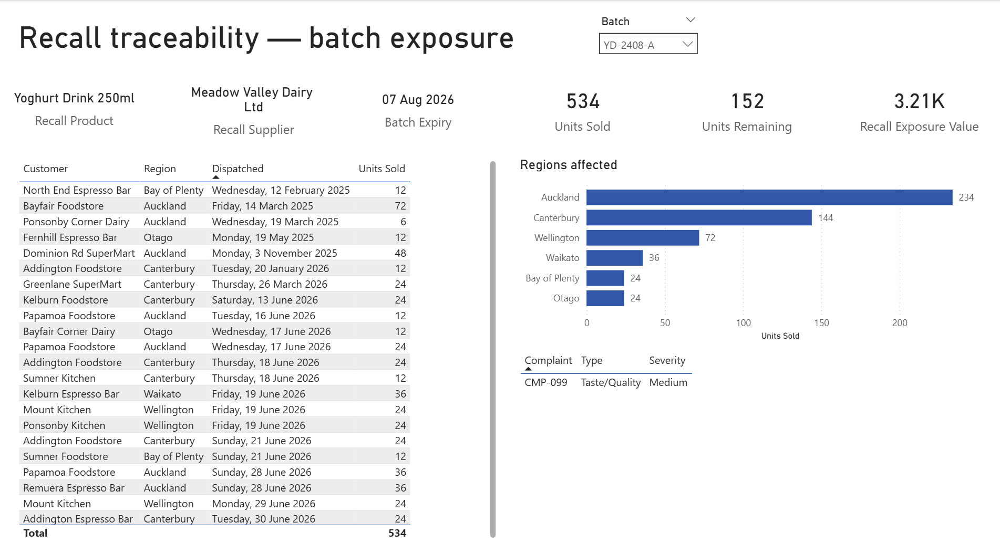

# FMCG Batch & Recall Risk Analytics

**An end-to-end Business Analyst / Data Analyst case study — from stakeholder discovery through to a Power BI dashboard and a costed set of recommendations.**

> **Simulated project.** FreshRoute Foods Ltd is fictional and all data is synthetically generated. Nothing here represents a real business, supplier or customer. It was built to demonstrate graduate-level BA/DA capability end to end, not to report on real trading. All figures are **as at 31 July 2026**.

---

## The problem

FreshRoute Foods is a small Auckland FMCG distributor running batch tracking, expiry monitoring, supplier certificates, orders and complaints across six separate Excel files and several email inboxes.

A café complained that a chilled yoghurt drink tasted "off". Nobody could say which batch it came from. Working out which customers had received stock from that batch took the team **six and a half hours**. The product turned out to be fine — the café's fridge was the problem — but had it been a genuine food-safety recall, six and a half hours would have been far outside what MPI expects.

The question this project answers: *can FreshRoute trace an affected batch to its customers fast enough to manage a recall — and what else is that same data gap costing them?*

---

## Headline results

| | |
|---|---|
| **Recall trace time** | 6.5 hours → **under 1 minute** |
| **Batch YD-2408-A traced to** | **18 customers** across **6 regions**, **534 units** dispatched |
| **Total recall exposure** | **$3,708.67** ($3,205.55 dispatched + $503.12 stock on hand) |
| **Orders with no batch identifier** | **17.6%** (316 of 1,796) |
| **Complaints with no batch identifier** | **46%** (46 of 100) |
| **Stock expired or expiring within 90 days** | **$37,963.28** across 60 batches |
| **Stock already past expiry, still on hand** | **$9,961.49** across 21 batches |
| **Requiring a decision this month** (expired + 30 days) | **$18,503.87** across 34 batches |

Three findings drove the recommendations:

1. **Traceability is the root cause, not the symptom.** 17.6% of orders and 46% of complaints carry no batch identifier. That single gap explains the 6.5-hour trace *and* means current supplier quality reporting understates issues by up to half.
2. **Expiry exposure is concentrated, so it is fixable cheaply.** Ten products carry 88% of the $37,963.28; three chilled lines carry close to half. Chilled stock is 83% of at-risk value on 70% of the batches. This needs a targeted rotation review, not a warehouse-wide programme.
3. **The internal risk model would have missed this recall.** The supplier's notification was never logged, and an open complaint against the same batch had been sitting unresolved for three weeks when the recall notice arrived.

Notably, the analysis **argues against** the intuitive response of dropping the supplier: Meadow Valley Dairy supplies more batches than anyone (53), has zero failed QC batches, the lowest issue rate (0.11) and the highest quality score (91.32). This reads as a single-batch event at a strong supplier, so the fix is faster logging of external notices — not supplier replacement.

---

## Dashboard

Five-page Power BI report. Full-size images in [`powerbi/screenshots/`](powerbi/screenshots/).

| Page | What it answers |
|---|---|
| [Executive Overview](powerbi/screenshots/01_executive_overview.png) | Portfolio KPIs, sales trend, open high-risk batches |
| [Expiry & Batch Risk](powerbi/screenshots/02_expiry_batch_risk.png) | What is expiring, what it is worth, and where it physically sits |
| [Supplier Quality](powerbi/screenshots/03_supplier_quality.png) | Scorecard, issue rates, expired documents |
| [Recall Traceability](powerbi/screenshots/04_recall_traceability.png) | Batch → customers, regions, exposure value |
| [Customer Complaints](powerbi/screenshots/05_customer_complaints.png) | Volume, severity, resolution time, batch-linkage gap |



*Recall Traceability page filtered to batch YD-2408-A — the trace that used to take 6.5 hours.*

---

## How it was built

| Stage | Output |
|---|---|
| **1. Discovery & analysis** | Problem statement, stakeholder map, discovery questions, business questions → [`ba-documents/`](ba-documents/) |
| **2. Data design** | 8-table relational model with deliberate real-world data quality faults → [`data/data_dictionary.md`](data/data_dictionary.md), [`ba-documents/erd.dbml`](ba-documents/erd.dbml) |
| **3. Cleaning** | Orphan, impossible-value and completeness checks; bad records quarantined into exceptions tables, never deleted → [`sql/cleaning_queries.sql`](sql/cleaning_queries.sql) |
| **4. Database** | Normalised PostgreSQL schema with constraints → [`sql/create_tables.sql`](sql/create_tables.sql), [`sql/import_log.md`](sql/import_log.md) |
| **5. Analysis** | Expiry risk, supplier quality, complaint patterns, recall traceability → [`sql/analysis_queries.sql`](sql/analysis_queries.sql), [`sql/recall_traceability_query.sql`](sql/recall_traceability_query.sql) |
| **6. Dashboard** | 5-page Power BI report → [`powerbi/`](powerbi/) |
| **7. Communication** | 15-page insights report + 9 prioritised recommendations → [`report/FreshRoute_Final_Insights_Report.docx`](report/FreshRoute_Final_Insights_Report.docx), [`ba-documents/09_recommendations.md`](ba-documents/09_recommendations.md) |

**Tools:** Excel, PostgreSQL, Power BI (DAX), Python (data generation), Markdown.

---

## Repository structure

```
├── 01_project_brief.md            Assignment brief from the Operations Manager
├── problem_statement.md           Problem framing
├── process_maps.md                Current and future state process maps
├── stakeholder_map.md             Stakeholder analysis
├── recommendations.md             Recommendations (long form)
├── mock_recall_scenario.md        The live traceability test
├── final_insights_report.md       Final 15-page insights report
│
├── ba-documents/                  BA document pack, numbered in reading order
│   ├── 01_problem_statement.md
│   ├── 02_stakeholder_map.md
│   ├── 03_discovery_questions.md
│   ├── 04_business_questions.md
│   ├── 05_business_requirements.md
│   ├── 06_user_stories.md
│   ├── 07_acceptance_criteria.md
│   ├── 08_assumptions_risks_constraints.md
│   ├── 09_recommendations.md
│   ├── erd.dbml                   Entity relationship model (dbdiagram.io)
│   └── erd_diagram.png
│
├── data/
│   ├── data_dictionary.md
│   ├── generate_raw_data.py       Reproducible synthetic data generator
│   ├── raw/                       Messy source workbook (never edited)
│   └── cleaned/                   Cleaned tables + exceptions tables
│
├── sql/                           Schema, cleaning, analysis, traceability queries
├── powerbi/                       Requirements, DAX measures, model review, screenshots
└── report/                        Final report (Word + PDF)
```

---

## Reading order

If you have five minutes, read the [headline results](#headline-results) above and look at the [Recall Traceability page](powerbi/screenshots/04_recall_traceability.png).

If you have twenty, read the final report — [Word version](report/FreshRoute_Final_Insights_Report.docx) (formatted, with figures) or [`final_insights_report.md`](final_insights_report.md) (plain text) — particularly Section 2 (data quality) and Section 6 (the recall test).

If you want the BA thinking, start at [`ba-documents/01_problem_statement.md`](ba-documents/01_problem_statement.md) and read through in number order.

---

## Honesty notes

These matter more to me than the headline numbers, and they are stated in full in Section 8 of the report:

- **The data is synthetic.** Findings demonstrate method, not real market insight.
- **Issue counts are floors, not totals.** Because 46% of complaints carry no batch ID, every supplier issue count in this project understates the true figure. The analysis says so rather than quietly reporting the number.
- **Bad records were quarantined, not deleted.** Batch B-0026 records 48,000 units against a plausible maximum of ~960; it is excluded from value-at-risk totals and the exclusion is documented and reversible.
- **Three batches holding stock have no expiry date** and appear in no expiry window, so all expiry reporting carries a small unmeasured gap.
- **Orders with missing batch IDs may contain recalled product.** The trace reports what can be proven and flags what cannot, rather than presenting an artificially clean answer.

---

## What I would do differently

The dataset was designed with the data quality faults I wanted to find, which is circular — with real data I would not have known where to look. The more useful skill was deciding what to do with broken records, and quarantining rather than deleting was the decision I would defend.

I would also validate the batch risk scoring model against real outcomes before recommending adoption. It is currently calibrated on judgement, which is why [`ba-documents/09_recommendations.md`](ba-documents/09_recommendations.md) recommends formally recalibrating it rather than trusting it as-is.

---

**Vyom Patel** · [vyomp987@gmail.com](mailto:vyomp987@gmail.com)
