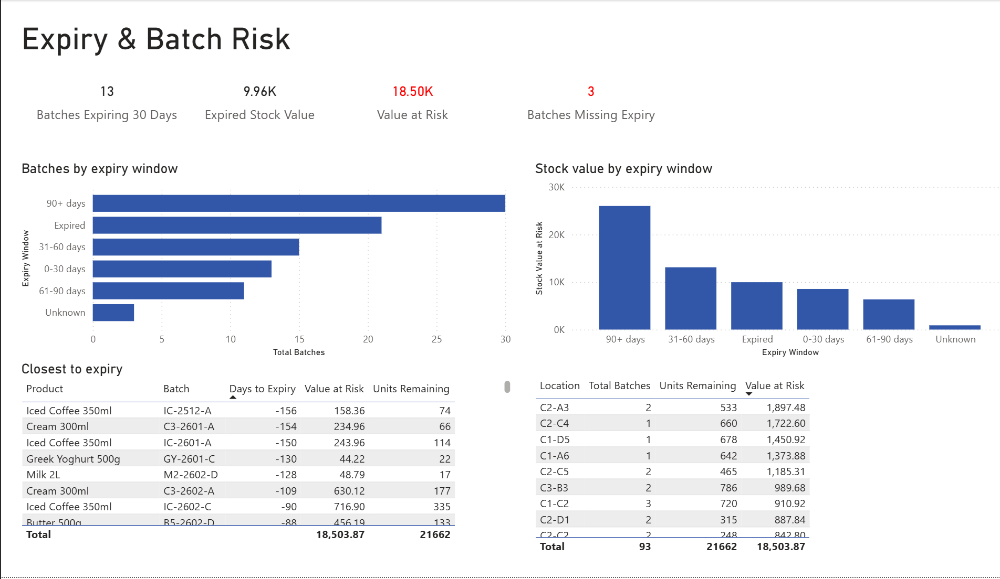
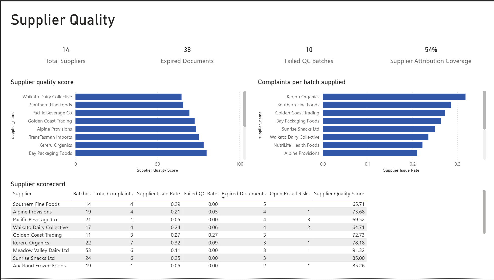
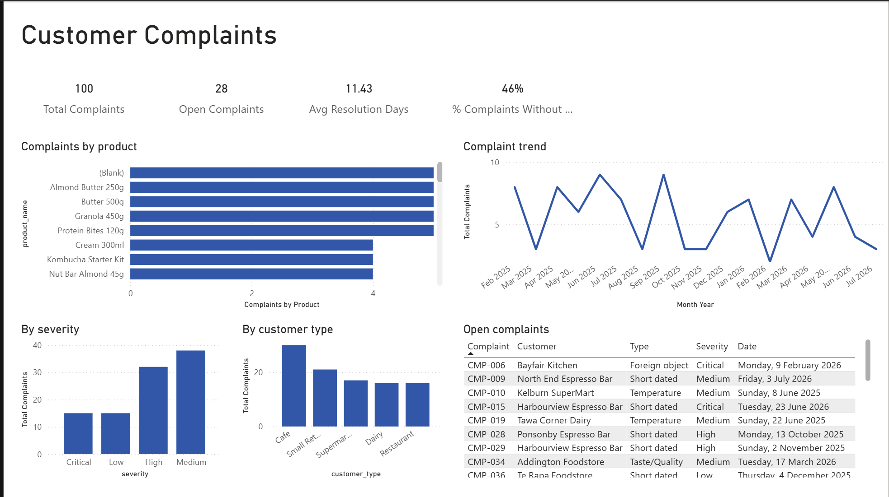

# FreshRoute Foods: Batch and Recall Risk Analytics

**Final Insights Report**

Prepared by: Vyom Patel
Report date: 5 August 2026
All figures as at 31 July 2026

---

## 1. Executive summary

FreshRoute Foods asked whether it could trace an affected batch to its customers quickly enough to manage a recall. This project cleaned eight datasets covering 298 batches, 1,796 orders and 100 complaints, loaded them into a normalised database, and built a Power BI dashboard to answer that question and monitor the underlying risks. A live recall scenario for batch YD-2408-A was traced end to end in under one minute, identifying 18 affected customers across six regions and $3,708.67 of exposure, against a manual baseline of 6.5 hours.

Three findings stand out. First, traceability is the core problem: 17.6% of orders and 46% of complaints carry no batch identifier, which is both the cause of the slow recall and the reason current supplier reporting understates quality issues by up to half. Second, expiry exposure of $37,963.28 is highly concentrated, with three chilled products accounting for close to half of it and $9,961.49 already lost to stock sitting past expiry. Third, the internal risk model would not have flagged the recall batch, because the supplier's notification was never logged in the system, and an open complaint about that same batch had been sitting unresolved for three weeks before the recall notice arrived.

The recommendations follow directly: make the batch identifier mandatory at order entry and complaint logging, log external supplier notifications on receipt, and introduce date validation at goods in alongside a scheduled expiry review.

---

## 2. Data quality findings

I ran a systematic check across all eight datasets, covering three categories: orphan checks (records referencing a parent that doesn't exist), impossible value checks (figures that cannot be true, such as negative quantities), and completeness checks (critical fields left blank). Rather than deleting problem records, I moved them into separate exceptions tables. Nothing was silently lost, every exclusion is documented, and every decision is reversible. Queries supporting this section are B4 to B6 in `sql/cleaning_queries.sql`.

**Broken batch linkage is the most serious issue.** Of 1,796 orders, 316 (17.6%) have no batch ID recorded. Of 100 complaints, 46 (46%) have no batch ID, and a further 5 have no product ID. The consequence is direct. When nearly half of all complaints cannot be tied back to a batch, FreshRoute cannot connect a customer's problem to the product that caused it, and cannot work in the opposite direction either, tracing from a suspect batch out to the customers who received it. This single gap is the root cause of the 6.5 hours the last recall took to complete.

**A number of records contain values that cannot be correct.** Batch B-0011 shows −120 units received. Batch B-0026 shows 48,000 units received against a plausible maximum of roughly 960, almost certainly a data entry error, and it has been excluded from value at risk calculations to prevent it distorting the totals. Five batches show quantity remaining exceeding quantity received. Four batches carry manufacture dates in the future, spread across four different suppliers. Two orders record zero or negative quantities sold, and one complaint shows −3 resolution days. Twenty-two batches are marked expired yet still show stock on hand, or 21 once the corrupted batch B-0026 is set aside. This is stock the system believes is sellable but is not, representing a write off that has not yet been recognised.

The most telling pattern here is the future dated manufacture records. Because they span four separate suppliers rather than clustering with one, they point to missing date validation in FreshRoute's own goods in process rather than to any single supplier's paperwork. It is also worth noting that three further batches were future dated when first checked on 17 July but no longer appear as at 31 July. The entry error was real, it simply becomes invisible once time passes. That is an argument for validating dates at the point of entry rather than relying on periodic checks.

**These gaps place a ceiling on what current reporting can tell FreshRoute.** Any supplier quality report the business runs today understates the true picture, because up to 46% of complaints never reach a supplier at all. The same limit applies to the supplier analysis in this report: every issue count should be read as a floor, not a full tally. Expiry reporting carries a comparable blind spot, with several batches missing expiry dates entirely and therefore absent from any expiry risk calculation.

**Supplier documentation is also incomplete.** There are 38 expired supplier documents on file, and supplier attribution coverage sits at 54%. More significantly, 156 of 298 batches (52%) originate from suppliers with at least one missing document type, meaning over half the stock FreshRoute holds traces back to a supplier whose paperwork is not current. That is an audit exposure as much as a quality one. This figure assumes all five document types are required for every supplier, and Quality should confirm that assumption before it is acted on.

---

## 3. Expiry & stock risk

Sixty batches with stock still on hand are either expired or will expire within 90 days, representing $37,963.28 of stock value. All figures in this section are as at 31 July 2026 and exclude batch B-0026, whose recorded quantity of 48,000 units is a confirmed data error (see Section 2). Queries supporting this section are C7 and C8 in `sql/analysis_queries.sql`.

**Exposure by expiry window.**

| Window | Batches | Value at risk |
|---|---|---|
| Expired | 21 | $9,961.49 |
| Critical (0 to 30 days) | 13 | $8,542.38 |
| High (31 to 60 days) | 15 | $13,103.95 |
| Medium (61 to 90 days) | 11 | $6,355.46 |
| **Total** | **60** | **$37,963.28** |

A further 30 batches sit beyond the 90 day horizon, carrying approximately $26,000 of stock value. This is deliberately excluded from the figures above, since stock more than three months from expiry is a planning consideration rather than a risk position. It is shown on the dashboard for completeness (Figure 1).

The most urgent figure is the combination of expired stock and stock expiring within 30 days, being $18,503.87 across 34 batches. That is the exposure requiring a decision this month, whether markdown, redistribution or disposal. The remaining $19,459.41 sitting in the 31 to 90 day windows is a planning horizon rather than an immediate one, and treating the two the same would misallocate effort.

**Stock already lost.** Of the total, $9,961.49 sits in 21 batches that have already passed their expiry date while still showing units on hand. This is not exposure but loss already incurred and not yet written off. Several are substantially overdue, including IC-2512-A at 156 days past expiry and C3-2601-A at 154 days. The presence of stock this far past expiry suggests write off is triggered by physical stock checks rather than by any date driven process.

**Concentration by product.** Exposure is highly concentrated. The ten highest value products account for $33,437.68, or 88% of the total, across 38 of the 60 batches. The six largest are:

| Product | Batches | Value at risk |
|---|---|---|
| Cream 300ml | 7 | $7,864.04 |
| Iced Coffee 350ml | 8 | $6,449.96 |
| Custard 600g | 3 | $3,899.88 |
| Sparkling Lemonade 750ml | 4 | $3,494.79 |
| Butter 500g | 4 | $2,949.80 |
| Protein Powder 1kg | 2 | $2,828.80 |

Cream 300ml and Iced Coffee 350ml together carry $14,314, roughly 38% of all near expiry value. Both also appear repeatedly among the most overdue batches, with Iced Coffee 350ml featuring three times and Cream 300ml twice in the ten batches furthest past expiry. Two independent views of the data pointing at the same products gives reasonable confidence this is a rotation problem specific to those lines rather than a general warehouse issue. The practical implication is that FreshRoute does not need a warehouse wide expiry programme. Tightening ordering and rotation on three chilled products would address close to half the exposure.

**Concentration by storage type.**

| Storage type | Batches | Value at risk |
|---|---|---|
| Chilled | 42 | $31,416.14 |
| Ambient | 18 | $6,547.14 |

Chilled stock represents 83% of near expiry value on 70% of the batches, so chilled batches are both more numerous and individually more valuable, averaging $748 against $364 for ambient. No frozen stock appears in the at risk population at all, which is consistent with its longer shelf life. Chilled is also the least forgiving category operationally, since short dated chilled product cannot be discounted for long or redistributed far before it becomes unsaleable. Expiry management effort is best directed at the chilled range.

**Concentration by location.** Risky stock is physically clustered rather than dispersed, which makes a targeted stock review practical. The five highest exposure locations hold $7,630.19 between them, roughly 41% of the expired and 30 day exposure:

| Location | Batches | Units remaining | Value at risk |
|---|---|---|---|
| C2-A3 | 2 | 533 | $1,897.48 |
| C2-C4 | 1 | 660 | $1,722.60 |
| C1-D5 | 1 | 678 | $1,450.92 |
| C1-A6 | 1 | 642 | $1,373.88 |
| C2-C5 | 2 | 465 | $1,185.31 |

Four of the eight highest exposure locations sit in the C2 aisle, together accounting for $5,693.23, or about 31% of urgent exposure. Three sit in C1. A stock review team working those two aisles would cover more than half the immediate risk without walking the full warehouse. Several of these locations hold a single high value batch rather than an accumulation of small ones, C2-C4 and C1-A6 among them, so a small number of physical checks resolves a disproportionate share of the exposure.

**One blind spot.** Three batches holding stock have no expiry date recorded and therefore cannot be assigned to any window. They appear as "Unknown" on the dashboard and are absent from every figure above. Seven batches in total lack an expiry date, the remainder having no stock on hand. Until those dates are captured, all expiry reporting carries a small unmeasured gap.

*Figure 1: Expiry and Batch Risk dashboard, as at 31 July 2026. Filtered to batches holding stock, excluding B-0026.*

---

## 4. Supplier quality

FreshRoute sources from 14 suppliers. Across the portfolio there are 38 expired supplier documents and 10 batches that failed quality control. Supplier attribution coverage sits at 54%, meaning nearly half of all quality signals cannot be traced back to the supplier responsible. Queries supporting this section are C9 to C11 in `sql/analysis_queries.sql`.

**Suppliers by total quality issues.** Ranking suppliers by combined failed QC checks, batch linked complaints and open recall risks:

| Supplier | Total issues | QC fails | Complaints | Recall risks |
|---|---|---|---|---|
| Kereru Organics (S-10) | 10 | 2 | 7 | 1 |
| Bay Packaging Foods (S-09) | 8 | 1 | 5 | 2 |
| Harvest Sauce Company (S-07) | 8 | 1 | 5 | 2 |
| Meadow Valley Dairy (S-01) | 7 | 0 | 6 | 1 |

Raw issue counts favour large suppliers, so rate matters more than volume. On complaints per batch supplied, Kereru Organics leads at 0.32 across 22 batches, followed by Southern Fine Foods at 0.29 and Golden Coast Trading at 0.27.

**Documentation gaps.** 156 of 298 batches, or 52%, originate from suppliers missing at least one required document type. These arise from eight supplier and document type gaps in total. Southern Fine Foods holds the most expired documents at five, followed by Alpine Provisions, Pacific Beverage Co and Waikato Dairy Collective at four each. This analysis assumes all five document types are required for every supplier, an assumption Quality should confirm before it is acted on.

**Meadow Valley Dairy is a special case worth stating plainly.** It is the supplier behind recall batch YD-2408-A, but the data does not describe a failing supplier. Meadow Valley supplies more batches than anyone else at 53, has recorded zero failed QC batches, carries the lowest issue rate in the portfolio at 0.11, and holds the highest quality score at 91.32. The recall therefore appears to be a single batch event at an otherwise strong supplier rather than the symptom of a deteriorating relationship. That distinction changes the appropriate response. The corrective action is faster logging of external recall notices and better batch traceability, not supplier replacement.

**Suppliers to prioritise for review.** Three warrant management attention, each for a different reason:

1. **Kereru Organics (S-10)**, on complaint volume and rate. Highest total issues at 10 and the highest complaint rate per batch at 0.32, with two QC failures alongside.
2. **Golden Coast Trading**, on quality control. Its failed QC rate of 0.27 is by far the highest in the portfolio, meaning more than a quarter of its batches failed inspection, albeit across a small base of 11 batches.
3. **Waikato Dairy Collective and Southern Fine Foods**, on documentation and overall score. They hold the two lowest quality scores at 64.71 and 65.71, with four and five expired documents respectively.

Pacific Beverage Co is worth watching for a different reason. Its complaint rate is very low at 0.05, but it carries three open recall risks, the most of any supplier. Low complaint volume does not mean low risk.

All of these counts are a floor rather than a full tally, because 46% of complaints carry no batch identifier and therefore cannot be attributed to any supplier. The true ranking could differ if that attribution gap were closed.

*Figure 2: Supplier Quality dashboard, as at 31 July 2026.*

---

## 5. Complaints

FreshRoute recorded 100 complaints across the period, of which 28 remain open. Average resolution time is 11.43 days. Queries supporting this section are C10 and C13 in `sql/analysis_queries.sql`.

**Which products attract complaints.** Raw counts are broadly flat, with Almond Butter 250g, Butter 500g, Granola 450g and Protein Bites 120g each recording five complaints. Raw counts are misleading, however, because they reward low volume products. Normalised per 1,000 units sold the ranking changes materially:

| Product | Complaints per 1,000 units |
|---|---|
| Nut Bar Almond 45g | 4.98 |
| Almond Butter 250g | 4.50 |
| Kombucha Starter Kit | 4.44 |

Rate rather than volume is the fairer basis for comparison, and Nut Bar Almond 45g does not appear in the top group on raw counts at all. Products with no complaints, such as Cheese Slices 250g at 0.00, are retained in the analysis rather than dropped, so the comparison covers the full range.

**Severity and customer type.** Medium severity is the largest group at 38 complaints, followed by High at 32, with Critical and Low at 15 each. That 47 complaints are High or Critical is notable against a total of 100. Cafés generate more complaints than any other customer type at roughly 30, ahead of small retailers at 21. Whether that reflects product handling, café expectations or simply café volume cannot be determined from this data alone.

**Trend.** Complaint volume fluctuates between two and nine per month across the period without a sustained direction. The variation appears to be noise rather than trend, and no month stands out as a systemic event. On the question of whether any batch or supplier is over represented, no reliable answer is possible while 46% of complaints lack a batch identifier.

**Resolution.** Average resolution across closed complaints is 11.43 days, with 28 complaints still open. The slowest averages by category belong to very small groups. Critical Taste/Quality complaints average 18.0 days, but from a single complaint, which makes it an anecdote rather than a pattern. The meaningful group is High severity Taste/Quality, averaging approximately 11 days across eight complaints. That is the population where faster resolution would have measurable effect. One complaint, CMP-021, was excluded from resolution averages because it recorded −3 resolution days.

**The attribution problem recurs here and is at its most visible.** 46 complaints have no batch identifier and five have no product identifier, which is why the largest single bar in the complaints by product chart is "(Blank)". The most common answer to "which product is this complaint about" is "we do not know."

*Figure 3: Customer Complaints dashboard, as at 31 July 2026.*

---

## 6. Recall test: Batch YD-2408-A briefing

**Situation.** Meadow Valley Dairy Ltd issued a recall notification for batch YD-2408-A, internal reference B-0187, Yoghurt Drink 250ml, expiring 7 August 2026. The queries supporting this trace are in `sql/recall_traceability_query.sql`.

**Distribution.** The batch reached 18 customers across 22 orders, totalling 534 units dispatched. Six regions are affected:

| Region | Units |
|---|---|
| Auckland | 234 |
| Canterbury | 144 |
| Wellington | 72 |
| Waikato | 36 |
| Bay of Plenty | 24 |
| Otago | 24 |

Auckland and Canterbury together account for 378 of 534 units, or 71% of the dispatched quantity, so recall communication should begin there.

**Financial exposure.** Total exposure is $3,708.67, comprising $3,205.55 of stock already dispatched and $503.12 held in the warehouse at location C2-A4, being 152 units at a unit cost of $3.31. The two figures answer different questions. The dispatched value represents potential refunds and reputational exposure. The on hand value is a direct write off that can be actioned immediately.

**An existing warning signal.** One complaint is already linked to this batch. CMP-099, a Taste/Quality complaint of Medium severity, was raised on 6 July 2026 and remains open and unresolved. It predates the supplier's recall notification. FreshRoute held an internal signal about this specific batch before the external notice arrived, but no process connected a single open complaint to a batch wide risk.

**An operational gap.** One affected customer, Addington Espresso Bar (C-016), has no contact person recorded. In a recall this is a customer that cannot be phoned.

**A gap in the internal risk model.** Under the batch risk scoring applied in C12, which weights an open recall risk at 5 points, expired stock at 4, a document problem at 2 and an existing complaint at 1, batch B-0187 scores only 3 and does not appear among the ten highest risk batches. The model failed to flag it because the supplier's notification was external and had not been entered into the recall risk register. An internal risk model that cannot see incoming supplier notifications will always miss them, however well its weights are calibrated.

**Time taken.** The full trace covering affected customers, quantities, regions, financial exposure and linked complaints completed in under one minute, against a documented manual baseline of 6.5 hours. The gain is not only speed. The manual process previously relied on cross referencing spreadsheets by hand, which risks missing customers entirely, whereas the query returns the complete set every time it is run.

**Honesty note.** This trace captures only orders carrying a batch identifier. Given that 17.6% of orders have no batch linkage, the true number of affected customers may be higher. Some of the 316 unlinked orders could contain this batch and there is no way to confirm it from the current data. The figures above are a floor.

*Figure 4: Recall traceability dashboard showing batch exposure for YD-2408-A, as at 31 July 2026.*

---

## 7. Recommendations summary

Full recommendations are set out in `ba-documents/recommendations.md`. The three with the greatest impact relative to effort are below.

**1. Make batch identifier mandatory at order entry and complaint logging.** This is the single highest value change. At present 17.6% of orders and 46% of complaints carry no batch link, which is the direct cause of both the 6.5 hour recall trace and the inability to attribute complaints to suppliers. Without it, every other measure in this report understates reality. Making the field mandatory at the point of capture, rather than attempting retrospective correction, closes the gap going forward at minimal cost.

**2. Log external supplier notifications into the recall risk register on receipt.** The internal risk model scored the actual recall batch at 3 out of a possible 12 and did not rank it in the top ten. It missed the batch because the supplier's notice lived in an inbox rather than in a system. A simple intake step, requiring any supplier quality notification to be recorded against the batch within 24 hours, would have surfaced B-0187 before the formal recall.

**3. Introduce date validation at goods in and a date driven write off process.** Four batches carry manufacture dates in the future across four different suppliers, which points to absent validation at receipt rather than supplier error. Separately, 21 batches sit past expiry still showing stock, some more than 150 days overdue, indicating write off is triggered by physical stock checks rather than by date. A validation rule at entry and a scheduled expiry review would address $9,961.49 of unrecognised loss and prevent its recurrence.

A fourth recommendation is worth noting for its return relative to effort. Expiry exposure is concentrated in three chilled products, Cream 300ml, Iced Coffee 350ml and Custard 600g, which together account for close to half of near expiry value. Reviewing order quantities and rotation for those lines specifically would address a disproportionate share of the $37,963.28 exposure without a warehouse wide programme.

---

## 8. Limitations & honesty notes

**The data is simulated.** FreshRoute Foods is a fictional company and this dataset was generated for the purpose of this case study. The figures demonstrate a method and a set of analytical techniques. They are not observations about any real business, and none of the supplier findings should be read as commentary on any actual organisation.

**Findings are a floor, not a ceiling.** This is the most important caveat in the report. With 17.6% of orders and 46% of complaints lacking a batch identifier, every count that depends on batch linkage is understated. Supplier issue totals, complaint attribution and recall exposure could all be materially higher. Where this affects a specific figure I have noted it in the section concerned.

**Specific exclusions and how they were handled.** Rather than delete problem records I moved them to exceptions tables, so every exclusion is documented and reversible:

- Batch B-0026, recorded at 48,000 units received against a plausible maximum near 960, is excluded from all value at risk calculations. Including it would have inflated exposure by an implausible margin.
- Batch B-0041, whose manufacture date falls after its expiry date, was quarantined. Four orders and one complaint referencing it had the batch link severed rather than the records removed, preserving the sales history.
- Orders O-00101 and O-00201 reference customers C-888 and C-999 who do not exist in the customer table, and were quarantined as orphans.
- Recall risk record RR-006 references batch B-9999, which does not exist, and was quarantined.
- Complaint CMP-021, recording −3 resolution days, is excluded from resolution time averages.

**Assumptions made.** Three assumptions materially affect the findings and should be validated before acting:

1. That all five supplier document types are required for every supplier. If some types apply only to certain supplier categories, the 52% documentation gap figure overstates the problem.
2. That recall risks marked "In progress" should be counted alongside those marked "Open." A stricter reading would reduce the recall risk counts in Section 4.
3. That the reporting date is 31 July 2026. Expiry classifications are relative to that date and shift as it moves. Three batches that appeared as future dated on 17 July no longer do so at 31 July, which illustrates the point.

**What this analysis cannot answer.** Whether café complaints reflect product handling, customer expectations or simply higher volume. Whether any batch or supplier is genuinely over represented in complaints, since almost half are unattributable. Whether the 316 unlinked orders include further units of the recall batch. Each of these requires either better data capture or information outside this dataset.
