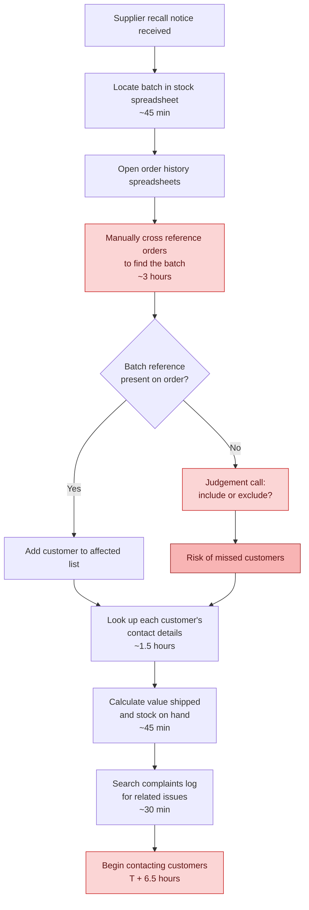
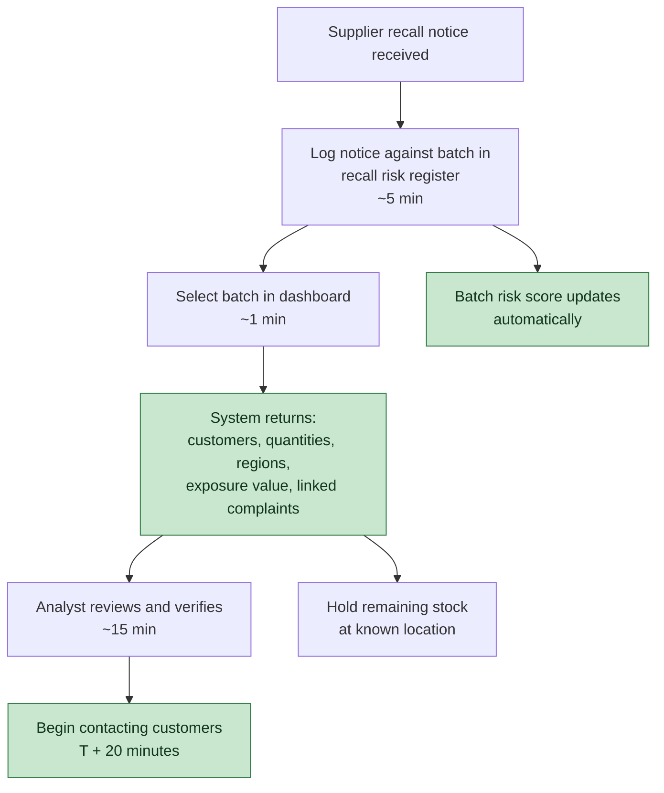
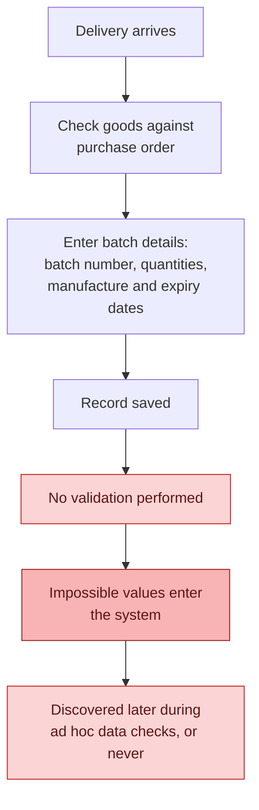
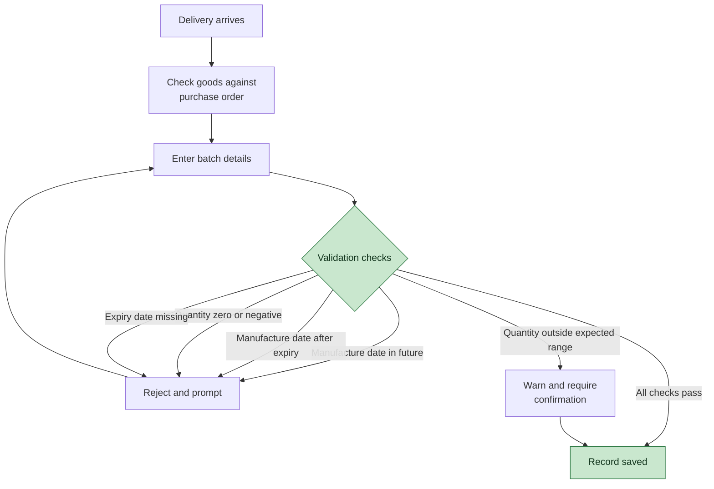
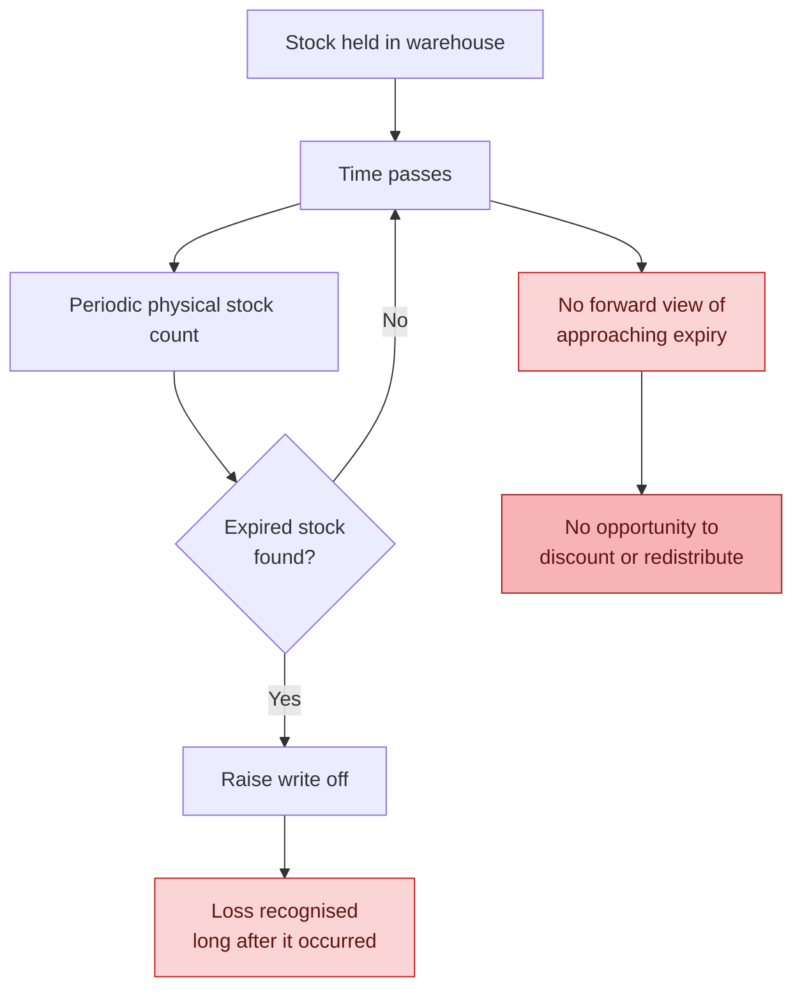
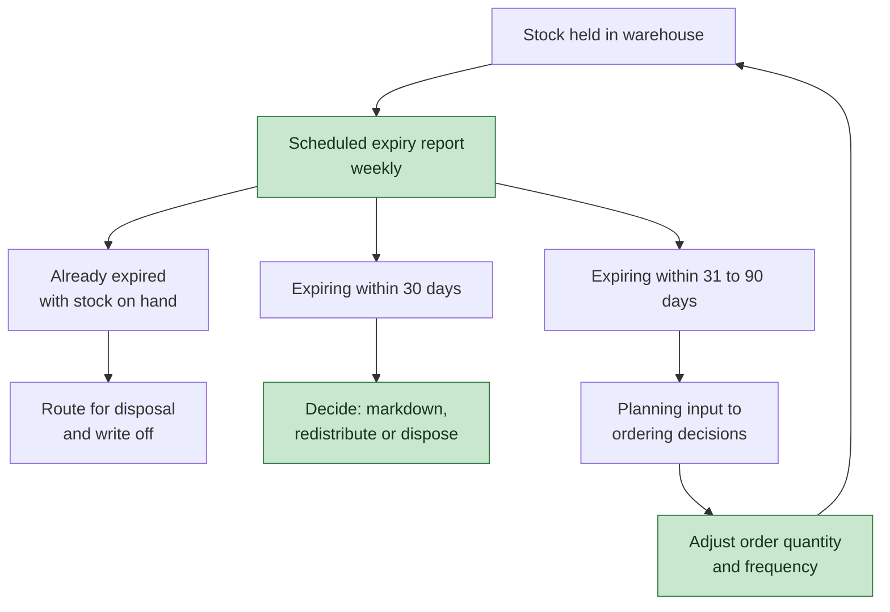

# Process Maps: As-Is and To-Be

**FreshRoute Foods Ltd — Batch and Recall Risk Analytics**

Prepared by: Vyom Patel
Report date: 5 August 2026

This document maps three processes in their current state and their proposed future state. Diagrams are written in Mermaid and render directly in GitHub.

The three processes were selected because each one produced a finding in the analysis:

| Process | Why it was mapped | Related recommendations |
|---|---|---|
| 1. Recall response | The 6.5 hour trace was the trigger for this project | R1, R2, R6 |
| 2. Goods in receiving | Four batches carry impossible manufacture dates | R3 |
| 3. Expiry management | $9,961.49 sits unrecognised in expired stock | R4, R5 |

---

## Process 1: Recall response

### As-Is

A supplier recall notice arrives and the trace is assembled by hand from spreadsheets. The heaviest cost is not any single step but the repeated manual cross referencing between order records and batch records, which have no reliable link.

**Pain points**

1. The manual cross reference at step D is the single largest cost, roughly three hours of the 6.5.
2. Step G is the critical weakness. With 17.6% of orders carrying no batch identifier, an operator must decide case by case whether to include an order, so the output depends on judgement and cannot be reproduced.
3. Customers are not contacted for 6.5 hours, during which affected product continues to be sold.
4. Missing contact details are discovered at step I, when they are most costly.
5. The complaints check at step K happens last, so an existing warning signal is found after the trace rather than before.

### To-Be

The batch identifier links orders to batches directly, so the trace becomes a query rather than a reconstruction. The manual effort that remains is verification and communication, which is where it belongs.

**What changes**

| | As-Is | To-Be |
|---|---|---|
| Time to actionable customer list | 6.5 hours | Under 20 minutes |
| Completeness | Depends on operator judgement | Complete for all linked orders |
| Reproducible | No | Yes, identical every run |
| Linked complaints surfaced | Last, if at all | Automatically, with the trace |
| Stock location | Searched manually | Returned with the trace |

**Dependency.** The to-be process only works if the batch identifier is captured reliably at order entry (recommendation R1). Without it, the query returns a partial answer and the judgement problem at step G reappears, simply hidden inside a query rather than visible in a spreadsheet. That would be worse, because a partial answer that looks authoritative invites less scrutiny than one that obviously required a judgement call.

**Residual limitation.** Even in the to-be state, orders with no batch identifier remain untraceable. The process improves from unreliable to reliable-for-linked-orders, not to perfect. The honest measure of success is the percentage of orders carrying a batch identifier, which is why R1 sits ahead of everything else.

---

## Process 2: Goods in receiving

### As-Is

Batch details are entered on receipt with no validation, so impossible values enter the system and are only discovered later, if at all.

**Evidence of failure**

- Four batches carry manufacture dates in the future, spread across four different suppliers.
- Batch B-0011 shows −120 units received.
- Batch B-0026 shows 48,000 units received against a plausible maximum near 960.
- Five batches show quantity remaining exceeding quantity received.
- Seven batches have no expiry date at all.

Because the affected batches span multiple suppliers rather than clustering with one, the cause is the receiving process rather than supplier paperwork.

### To-Be

Validation at the point of entry, so errors are caught by the person who can still correct them.

**Why validation at entry rather than periodic checking.** A future dated manufacture record stops looking wrong once time passes. Three batches that appeared as future dated on 17 July no longer did so by 31 July, even though the original entry error was equally real. Any process that relies on finding these errors later will always understate the problem. The control has to sit at the moment of entry.

Note the distinction between a hard reject and a soft warning. Impossible values are rejected outright. Implausible but possible values, such as an unusually large quantity, generate a warning that requires confirmation rather than blocking a legitimate bulk delivery.

---

## Process 3: Expiry management

### As-Is

Expiry is discovered physically. Stock ages on the shelf until someone finds it during a count, by which point the value is already lost.

**Evidence of failure**

- 21 batches have passed expiry while still showing stock on hand, totalling $9,961.49.
- Several are substantially overdue: IC-2512-A at 156 days past expiry, C3-2601-A at 154 days.
- Stock on hand overstates sellable inventory by the value of those batches.

### To-Be

A scheduled review with both a backward and a forward view, so action is possible before value is lost rather than only after.

**The key distinction the to-be process introduces** is between exposure and urgency. The as-is process has no view of either. The to-be process separates stock requiring a decision now ($18,503.87 across 34 batches, expired plus 30 days) from stock that is a planning consideration ($19,459.41 in the 31 to 90 day windows). Treating both the same misallocates effort.

**Targeting.** The report should be read by product as well as by window. Exposure is concentrated: three chilled products account for close to half of near expiry value, and chilled stock overall represents 83% of it. Feeding this back into ordering, shown as the loop from step I, is what converts the report from a monitoring tool into a preventive one.

---

## Summary of process changes

| Process | Core change | Measure of success |
|---|---|---|
| Recall response | Batch identifier links orders to batches, so tracing becomes a query | Time to actionable customer list; % of orders carrying a batch identifier |
| Goods in receiving | Validation moves from periodic checking to point of entry | Count of impossible values entering the system per month |
| Expiry management | Expiry is monitored on a schedule with a forward view, not discovered physically | Value of stock written off after expiry, versus value actioned before it |

Each measure is deliberately a leading indicator where possible. Counting errors caught at entry is more useful than counting errors found later, because the second number falls for the wrong reasons as time hides the evidence.

---

## Notes and limitations

These maps describe the process as inferred from the data and the recall scenario, not from direct observation or interviews with the staff who perform the work. Before implementation they should be validated with the Operations and Quality teams, who will know steps and constraints that leave no trace in the data.

The timings in the as-is recall process are apportioned from the documented 6.5 hour total and are indicative rather than measured.

The data used in this analysis is simulated. FreshRoute Foods Ltd is a fictional company created for this case study.
