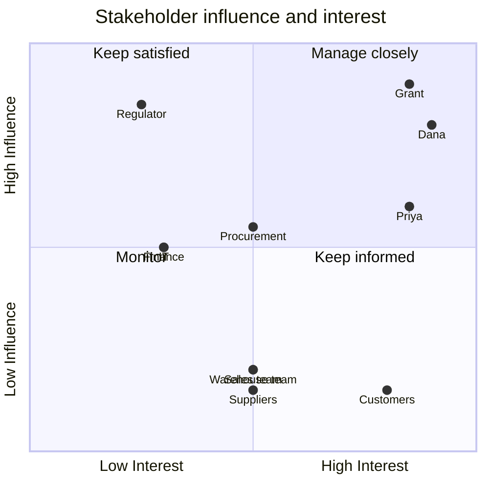

# Stakeholder Map

**FreshRoute Foods Ltd — Batch and Recall Risk Analytics**

Prepared by: Vyom Patel
Date: 5 August 2026

---

## Stakeholder register

| Stakeholder | Role | Interest in this project | What they need from it | Influence | Interest |
|---|---|---|---|---|---|
| Grant | General Manager | Accountable for regulatory compliance and commercial exposure | Confidence that a recall can be handled quickly, and the cost quantified | High | High |
| Dana | Operations Manager | Owns warehouse, stock and order fulfilment | A forward view of expiry risk and a faster recall process | High | High |
| Priya | Quality Manager | Owns supplier quality, complaints and recall response | Supplier issues traceable to source, and recall notices logged before they escalate | Medium | High |
| Warehouse team | Stock handling and counts | Perform the physical work the analysis directs | Clear, targeted instructions rather than a full warehouse sweep | Low | Medium |
| Sales team | Customer relationships | Contact customers during a recall | Complete and current customer contact records | Low | Medium |
| Procurement | Supplier ordering | Sets order quantities and frequency | Evidence of which product lines are over ordered relative to shelf life | Medium | Medium |
| Finance | Write offs and stock valuation | Approves write off of expired stock | Accurate stock on hand and timely recognition of loss | Medium | Low |
| IT | Systems and data | Would implement any validation changes | Clear, specific requirements rather than general requests | Medium | Low |
| Suppliers | External, 14 organisations | Subject of quality analysis; source of recall notices | Fair assessment based on evidence rather than incident recency | Low | Medium |
| Customers | External, 70 trade accounts | Receive affected product during a recall | To be contacted quickly and accurately | Low | High |
| Regulator | External | Oversees food traceability obligations | Evidence that traceability exists and is demonstrable | High | Low |

---

## Influence and interest grid

**Manage closely.** Grant, Dana and Priya are the primary stakeholders. Grant needs the commercial and regulatory picture, Dana needs the operational detail, and Priya needs the supplier and complaint view. The final report is written for Grant and Dana; the supplier analysis is written for Priya.

**Keep satisfied.** The regulator has high influence and low day to day interest. The relevant output is evidence that traceability exists and can be demonstrated, which is what the recall scenario and the documented method provide.

**Keep informed.** Customers have a strong interest in the outcome but no influence over the project. They experience its success or failure directly, through how quickly and accurately they are contacted during a recall.

**Monitor.** The warehouse, sales and procurement teams do the work the analysis directs. Their interest is practical: they need specific, targeted actions rather than broad findings.

---

## Stakeholder needs mapped to project outputs

| Stakeholder | Primary need | Where it is addressed |
|---|---|---|
| Grant | Recall exposure quantified in dollars | Report Section 6; Recall Traceability dashboard |
| Grant | Assurance the business could withstand an audit | Report Sections 2 and 8; documented method |
| Dana | Forward view of expiry risk | Report Section 3; Expiry and Batch Risk dashboard |
| Dana | Faster, repeatable recall process | Process Maps, Process 1; recall traceability query |
| Priya | Supplier quality ranked by evidence | Report Section 4; Supplier Quality dashboard |
| Priya | Early warning of batch level risk | Report Section 6; recommendation R2 |
| Procurement | Which lines are over ordered relative to shelf life | Report Section 3, product concentration; recommendation R5 |
| Finance | Accurate view of unrecognised write off | Report Section 3, expired stock; recommendation R4 |
| Warehouse team | Targeted rather than exhaustive stock review | Report Section 3, location concentration |
| Sales team | Complete customer contact records | Report Section 6; recommendation R6 |
| IT | Specific validation rules to implement | Process Maps, Process 2; recommendation R3 |

---

## Communication approach

| Stakeholder | Format | Frequency |
|---|---|---|
| Grant | Executive summary and headline figures | On completion, then quarterly review |
| Dana | Full report plus dashboard access | On completion, dashboard ongoing |
| Priya | Supplier quality section plus dashboard access | On completion, dashboard ongoing |
| Procurement, Finance | Relevant section extract | On completion |
| Warehouse, Sales | Specific action lists, not the full report | As actions arise |
| IT | Requirements document | When recommendations are approved |

The distinction matters. The warehouse team does not need a 15 page report; it needs to know which locations to visit. Sending the full document to everyone is the fastest way to have none of it read.

---

## Conflicts and tensions to manage

**Procurement and Operations on order quantities.** Reducing order quantities on the three concentrated chilled lines lowers expiry exposure but may raise unit costs or increase order frequency. This is a genuine trade off between working capital and waste, and it belongs to Grant rather than to either team alone.

**Quality and supplier relationships.** The supplier analysis names specific suppliers. Presented poorly, it damages relationships that took years to build. This is why the recommendations state explicitly that the evidence does **not** support changing supplier over the recall, and why suppliers are ranked by rate rather than raw issue volume, which would otherwise penalise the largest suppliers simply for supplying more.

**Operations and IT on validation.** Mandatory fields and validation rules slow down data entry. The warehouse team bears that cost; the benefit accrues during a recall, which is rare. This asymmetry is the main risk to recommendation R1 being adopted in practice, and it needs Grant's visible support to overcome.

---

## Note

Stakeholder names and roles are part of the simulated case study. FreshRoute Foods Ltd is a fictional company created for this project.
